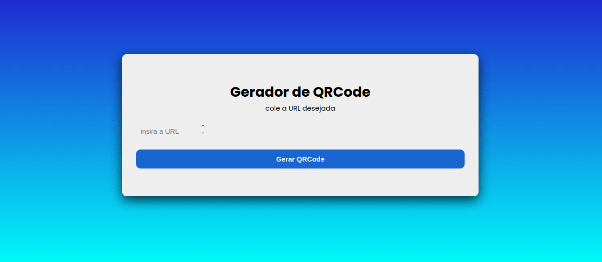

<h1 style='font-size: 40px'>QR Code Generator</h1>

With the qr code generator it is possible to create a qr code that targets the desired url

The images that contain the qr code were requested from an API

<h2 style='font-size: 25px'>Main technologies used in application development:</h2>

- React

- Typescript
